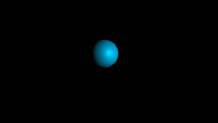

# 前言

最近看一些游戏视频，看到了很精彩的布料模拟。然后Unity里也自带了布料物理组件，但是以前只是拿来用，并没有去了解过其背后的实现原理。于是这两天上网搜了一下相关的文章，并准备动手做一个。

筛选了一遍之后，找到一个讲解比较详细的如下:

[CS114 Project 3:
Cloth Simulation using Mass-Spring System](https://www.ics.uci.edu/~shz/courses/cs114/docs/proj3/index.html)


下面会参照以上的文章，大致说明一下背后的物理数学原理，然后用Unity的ComputeShader实现一个入门版本的GPU布料模拟。

先放个效果图:




# 1. 网格质点弹簧模型

## 1.1 弹性力

这是目前用的比较多的一种布料物理建模。思路是将一块布料视作由一个个质点构成的网格，网格之间由弹簧相连接。如下图:


质点之前的连接分为三类，分别用以模拟材料中的三种力:

- 上下左右相邻质点连接，模拟结构力(Structural)，如拉伸和收缩。
- 对角线连接，模拟剪力(Shear)。
- 上下左右跨一个质点连接，用以模拟材料弯曲的力(Flexion)。

弹簧的力学模型满足[胡克定律](https://baike.baidu.com/item/%E8%83%A1%E5%85%8B%E5%AE%9A%E5%BE%8B/2307271?fr=aladdin)，即

$$
F = -K_s\Delta x
$$

其中$\Delta x$为弹簧的伸缩量。

我们把结构力、剪力、弯力加起来称为布料的内部受力，记为$F_i$。

## 1.2 阻尼力

质点在运动的时候，通常是有能量耗散的。弹簧振子如果没有耗散就会永远的震动下去。这不符合现实。因此需要加入阻尼力来模拟这种耗散。公式为

$F_d =-C_dv$

其中$C_d$为阻尼系数，v为运动方向。

## 1.3 重力

布料通常还会受重力，记为$F_g$

$F_g=mg$

g为重力加速度，垂直往下9.8

## 1.4 外力 

布料还会受一些外力，例如风力等等。记录为$F_e$


## 1.5 运动方程

综合以上几种受力，这样我们就得到了质点的受力计算方式:
$F = F_i + F_d + F_g + F_e$

有了F之后，根据牛顿二定律，就可以计算出质点的加速度:

$$
a = F/m

$$

有了加速度，就可以计算质点的速度:

$$
v = v + a *dt
$$

然后计算质点的位移:

$$
x = x + v * dt
$$

重复迭代以上步骤，即可以模拟布料运动。

以上是最简单的一种模拟方式，下面在Unity里实现。


# 2. 实现


## 2.1 ComputeShader


### 2.1.1 参数定义

使用两个Buffer，分别用来储存质点的位置和速度:

```hlsl
//所有质点的位置
RWStructuredBuffer<float4> positions;
//所有质点的速度
RWStructuredBuffer<float3> velocities;
```
positions之所以用float4，是因为这个buffer到时候直接提供给普通的shader用作模型渲染。


定义好一系列的参数:

```hlsl

//x表示横向质点数量，y表示纵向质点数量,z = x * y
uint4 size;

//弹性系数,xyz分别对应结构弹簧、剪力弹簧、弯曲弹簧
float3 springKs;

//弹簧在松弛状态下的长度。xyz分别对应结构弹簧、剪力弹簧、弯曲弹簧
uniform float3 restLengths;

//单个质点的质量
uniform float mass;

//阻尼系数
#define Cd 0.5

//流体(风)参数
float4 viscousFluidArgs;
#define Uf viscousFluidArgs.xyz
#define Cv viscousFluidArgs.w

//单次迭代时间间隔
float deltaTime;
#define dt deltaTime
```

### 2.1.2 Kernel分配

CS包含三个kernel:
- Init - 用作初始化Buffer
- StepV - 用来计算每个质点的受力、然后更新质点的速度
- StepP - 根据StepV计算出来的速度，更新质点的位置

运行流程大致如下：

```
Init;
while(true){
    StepV;
    StepP;
}
```

### 2.1.3 受力计算

#### a. 弹性力计算

根据胡克定律，当我们知道两个质点p和q的位置，以及他们之间的弹性系数，就可以计算p的受力:

```hlsl
//弹性力计算
//springType 0,1,2分别代表结构弹簧、剪力弹簧、弯曲弹簧
static float3 getSpring(float3 p,float3 q,uint springType){
    float3 dp = p - q;
    float len = length(dp);
    float restL = restLengths[springType];
    return dp * (springKs[springType] * (restL * rcp(len) - 1));
}
```

遍历相邻12个质点，用以上公式计算弹性力求和，即可得到$F_i$。

#### b. 阻尼力计算

```hlsl
float3 fd = - Cd * velocity;
```

#### c. 重力计算

```
float3 fg = float3(0,-9.8,0) * M;
```

#### d. 风力计算

```
float3 fv = Cv * (dot(normal,Uf - velocity)) * normal;
```

其中Uf为float3,代表风方向和强度, Cv为最终增加系数。风力只作用于质点法线方向，因此我们将计算出风力和质点的相对运动速度，并投影到法线方向来计算受力。


### 2.1.4 速度迭代

按照前面给出的迭代公式，代码很简单:

```hlsl
float3 a = f * rcp(M); // a = f/m
float3 velocity = getVelocity(index);
velocity = velocity + a * dt;
velocities[index] = velocity;
```

### 2.1.5 位置迭代

```hlsl
float3 velocity = getVelocity(index);
float3 position = getPosition(index);
position += velocity * dt;
setPosition(index,position);
```

至此就完成了布料的整个物理模拟单次迭代计算过程。

## 2.2 渲染

渲染不是本文重点，因此在本项目中直接把Positions这个Buffer丢给普通的Shader，给予diffuse效果渲染。


# 3. 进阶

以上的实现方式，有个缺点就是迭代的deltaTime必须很小，模拟效果才是稳定的，否则效果就会崩塌。 而deltaTime的取值与 $\sqrt{m / K_s}$有关。我看到一些文章说dt小于以上项即可。但在本项目的实际测试中并不是这样。本项目m = 1, k =10000情况下, dt取5ms才有稳定模拟效果。

因此在一个渲染帧中，通常要进行好几次迭代模拟。

那么有没有更牛逼的数值解法，可以增加迭代步长，而又依旧保持模拟的稳定性呢？

我在网上查了一些文章，列一些如下:

[Wei_Cloth](https://www.cs.umd.edu/class/fall2019/cmsc828X/LEC/Wei_Cloth.pdf)

[Cloth](http://gamma.cs.unc.edu/gcloth/cloth.pdf)

总结一下就是

质点的运动学方程，用微分参数方程可以写作如下:

$$

\begin{aligned}
&\frac{dv}{dt} = F(x,v)m^{-1}\\
&\frac{dx}{dt} = v   
\end{aligned}

$$

其中x和v均是关于t的函数。

针对以上微分方程，在数值计算上有很多种方法，其中一些如下:

- 显示欧拉法
- 隐式欧拉法
- 龙格-库塔(Runge-Kutta)法
- [Verlet积分法](https://www.cnblogs.com/crackpotisback/p/5293991.html)
- and so on...

这些好像都是熟悉的名字，但又怎么都想不起来了。
实际上本项目采用的即是显示欧拉法。按照paper里的说法，后几种的迭代稳定性要比显示欧拉法要好，但是我目前还没能在CS中实现出来。

# 4. 疑问

目前在项目中尝试过以下几种迭代法:

1). 目前采用的

$$
\begin{aligned}
&v_{n+1} = v_n + a_n\Delta t \\
&x_{n+1} = x_n + v_{n+1}\Delta t
\end{aligned}
$$


2). 我理解的正统显示欧拉法

$$
\begin{aligned}
&v_{n+1} = v_n + a_n\Delta t \\
&x_{n+1} = x_n + v_{n}\Delta t
\end{aligned}
$$

3). 用均加速来计算位置(2阶泰勒展开)

$$
\begin{aligned}
&v_{n+1} = v_n + a_n\Delta t \\
&x_{n+1} = x_n + v_{n}\Delta t + \frac{1}{2}a_n\Delta t^2
\end{aligned}
$$

4). Verlet积分法

$$
\begin{aligned}
&x_{n+1} = x_n + v_{n}\Delta t + \frac{1}{2}a_n\Delta t^2 \\

&v_{n+1} = v_n + \frac{1}{2}(a_{n+1} + a_n)\Delta t
\end{aligned}
$$

稳定性上(1)和(4)差不多，(2)和(3)很差。

那么我有以下的疑问:

- 为什么(2)和(3)会比(1)的稳定性差呢？(3)都是二阶精度了，凭感觉误差要更小一些？
- 更进一步的，如何精确的用数值方法去估计迭代法稳定性呢？或者说对每种数值解法，如何去精确的计算出deltaTime的上限值呢？

于是我翻箱倒柜找出了《微分方程数值解法》李荣华第四版..希望一段时间后能回来解答这些疑问。